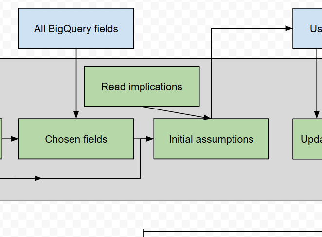
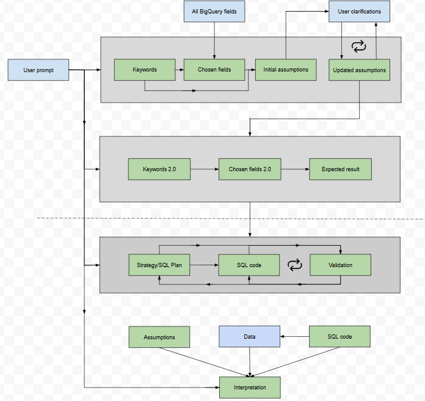

# Project - Leveraging LLMs for Product Analytics in Visma

## Part 0 - Preface

**Author**: David Ye - Slack or david.ye@visma.com

**Date**: 2025-03-25

**Purpose**: Develop a POC (Proof-of-Concept) LLM (Large Language Model) pipeline that can be used for product analytics.

**To**: The Product Analytics team at Visma Group. 

**Prerequisites**:
- A LLM; the current pipeline uses Gemini Flash 2.0. Choice of model does matter.
- A database; the current pipeline uses BigQuery.
- Clean and structured data. Works for less structured and clean but the LLM may perform worse.

**Changes since the presentation (small errors)**:
The flowchart now better represents what happens. There is one step that is omitted in the flowchart due to readability reasons. See Part 1.3 Validation. 

## Part 1 - Technical/Architecture Overview

The only relevant file is *DataQueryAgent.ipynb*. The other files are previous saved versions of the AI (worse versions) and can be ignored (unless you want inspiration). The main function is called “process_prompt” and is a part of the class DataQueryAgent. There is little structure in which of the functions are in the class and which of them are not (sorry). Look at the “process_prompt” function to follow the architecture.

The architecture is also illustrated in the last part of this document - the appendix. It can be divided into four parts: **1. Understanding the prompt, 2. Understand the prompt on a deeper level, 3. Create the code, 4. Interpret the results**. Each box in the architecture (look at the illustration) is either green or blue. A green box implies the involvement of a LLM. A prompt is sent to the LLM to generate the text/object on the box. The input data for each of these green boxes consists of some instructions (see the source code) and data from which the arrows originate from. There are some arrows pointing at big gray sections. That means the data is sent to every box in that gray section. A blue box implies a process that does not involve a LLM. 

Both of the architecture and the instructions sent to the LLM affect the accuracy of the result. I have solved minor issues/details by incorporating them into the instructions. More general issues have been solved through architectural changes. The instructions sent to the LLM can be found in the code.

Below are descriptions of what each box in the section does.

### 1. Understanding the prompt
- *User prompt*: User prompt.
- *All BigQuery fields*: All available fields in the current table, along with their descriptions and types.
- *Keywords*: LLM extracts keywords from the prompt. Function name: “extract_keywords”. 
- *Chosen fields*: LLM extracts relevant fields from the table. Function name: “field_selection”. After it manages to extract relevant fields, it will extract the descriptions and types of the fields. The fields together with their descriptions and types constitute the whole “Chosen fields” box in the architecture. If there are no available fields (e.g. a prompt asking about data we don’t have), this will return ‘false’ and stop the program.
- *Initial assumptions*: LLM makes first assumptions on the prompt to clarify ambiguities. Function name: “make_assumptions”
- *User clarifications*: User clarifies and updates assumptions.
- *Updated assumptions*: LLM updates its current assumptions with user clarifications. Currently, the steps *User clarifications* and *Updated assumptions* will continue until the user presses “enter” or writes “yes” or “y”. Function name: “interpret_clarification”

### 2. Understand the prompt on a deeper level
- *Keywords 2.0*: LLM extracts keywords from the prompt with respect to the assumptions. Function name: “extract_keywords”
- *Chosen fields 2.0*: LLM extracts relevant fields from the table with respect to the assumptions. Function name: “field_selection”
- *Expected result*: LLM provides the expected result in words (data that should be retrieved) to best answer the prompt. Function name: “expected”

### 3. Create the code
- *Strategy/SQL plan*: LLM creates a step-by-step SQL blueprint. It takes as much information as possible to first create a blueprint for how to extract correct data. This blueprint contains explicit SQL operations on what to do. Function name: “create_strategy”
- *SQL code*: LLM creates the code based on the strategy from the previous step together with other information such as assumptions, expected result, etc. Function name: “create_sql_code”
- *Validation*: LLM validates the query. **The validation step is actually divided into two steps (two functions)**. **The first step** involves verifying the querying to see if it matches the prompt and the expected result, and if it has correct syntax. Currently, the LLM has 3 chances to do it. If the query is not valid, it will return a list of reasons why it is not valid. These reasons are currently not utilized. The reason why they are not utilized to create new strategy/code is because they were created by previous knowledge (keywords, assumptions, etc.). It could be that the previous knowledge is at fault and not the step where you are creating the strategy or code. If the query is valid, **the second step** begins where it will be sent through an in-built BigQuery “Dry function” that checks if the syntax is truly correct. The LLM has 3 chances to pass the dry test. If it fails, the LLM will try to correct the error. If it passes the dry test, the query will be sent to fetch data. Rare errors may occur after it passes the dry test. Failing on the second step will not let it return to the first step. Function names: “verify”, “correct_sql_error”.

### 4. Interpret the results
- *Assumptions*: Same assumptions as in 1e.
- *Data*: The queried data.
- *SQL code*: Same code as in 3b.
- *Interpretation*: LLM interprets and analyzes the given data and context. Function name: “result_interpretation”.

## Part 2 - Findings and Insights
### The optimal pipeline
The best pipeline that has worked the best is one that simulates a chain-of-thought reasoning guide or a step-by-step guide. As an example, the current pipeline extracts keywords, and then extracts relevant fields. Based on the information it will do its best to make relevant assumptions. We then repeat the process to obtain the expected result. Currently, the most difficult prompts are the ones that can be interpreted in many ways. The pipeline aims to reduce ambiguities. 

**Following the logic of reducing ambiguities, there are two main options to consider.**
- Improve the quality of your data.
    - Reason: Ambiguities can arise from conflicting expectations between the LLM and the data. Examples:
        - LLM expects a browser to be called Edge, and not Edge 13.7, which is the case in current BigQuery data.
        - In many cases, the LLM might not know what a chunk really is (e.g. why would it use the field chunk_started_date over session_started_date) in the session_chunks table? There might not be any use cases and it is simply there as an “event trigger”. 
    - Main actions: 
        - Have only one table for LLM use. There are pros and cons with several tables but this will also add an extra layer of difficulty for the LLM to retrieve correct data.
        - Add descriptions to all fields to provide information to the LLM.
        - Not related to changing metadata but providing sample data to the LLM might improve its understanding of the data.
- Improve the pipeline by increasing more awareness.
    - Reason: Assuming the data is reasonable, we should be able to improve the pipeline to make sure the LLM fully understands the prompt. The part above the dashed line in the illustration of the architecture should be in focus. Example:
        - The main objective is to make the LLM understand the prompt “Based on our customers; what days and times is the best for performing updates, maintenance?” is almost equivalent to “When are our users the least active?” but for all similar cases. Reduce possible implications in the prompt to actionable points.
    - Main actions:
        - Keep experimenting! Knowing what to experiment and improve on is key to success and suggestions have been given above. Try to approach reasonably e.g. having an additional step before the initial assumptions that give suggestions or comments on what the prompt implies. These implications can then be given to the initial assumptions. See image below for illustration.

### Fix incorrect syntax
Ensuring correct query is also important to make this work in practice. This part hasn’t been experimented with too much in terms of changes in the architecture. Recurring errors can often be solved by instructing the LLM in the prompt what to avoid. However, there are instances in which I haven’t been able to solve. 

One idea could be to break the function that creates the full code into several functions (each small function has its own purpose e.g. one ensures correct ordering of data, one ensures correct grouping of data). One drawback of this approach is that the relations between each component in the code might not be that straightforward and it’s not easy to build a query step-by-step. (Analogy using mathematics: Having several functions that build the code on top of each other would assume a linear relationship but in-reality, it is non-linear).

Experimenting with the validation step (to see if the query aligns with the expected result) is also important as it can classify incorrectly (false positives and false negatives queries).

### Current strengths of the LLM 
The main strength of the LLM is its ability to follow up and give the user good and trustworthy data if and only if the given prompt explicitly asks for data that can be directly extracted. Examples:
- How much did the total session time increase or decrease in percentage and number between each month in 2025 compared to the months in 2024? Can you divide into user roles
- When are our users the least active? Give top 10 combinations of days and times. Segment it into 2 hours so for example 0-2am, 2-4am and so on
- Extract top 10 customers with longest session times in 2024, show the number of unique users and total sessions as well.

The LLM will be consistent in giving the same answer to the example prompts (deviations are rare). Another strength is the model’s explainability - ensuring that the user knows how the data is extracted (deviations are rare).

### Standalone product/tool
This has the potential to be a standalone tool that can be integrated and used in conjunction with other tools. Analyzing data can be generalized beyond applying to the baseline report. You know what I mean. :)

### David’s recommendation in short
- Building a pipeline that fully works is difficult. Lots of experimentation is required.
- Break the pipeline to a step-by-step guide. 
- To improve the pipeline, make sure the LLM understands the prompt even better than it does now. Do it by adding new components or changing the architecture.
- Changing the instructions in the prompt can improve accuracy. Doing this can help solve recurring minor issues or make the LLM change behavior.
- The current pipeline’s best use case is to extract data given a prompt that directly asks for that data.
- This AI should avoid being an extension to an existing product. Instead, this has the potential to be a standalone tool.

## Part 3 - Considerations
- Currently there is no limit on how much GB we can query. Set a limit?.
- Currently, there is no limit on how long a run can last. Set a limit?.
- Currently, there is no limit on how many assumptions the user can make. Set a limit?.

## Appendix

